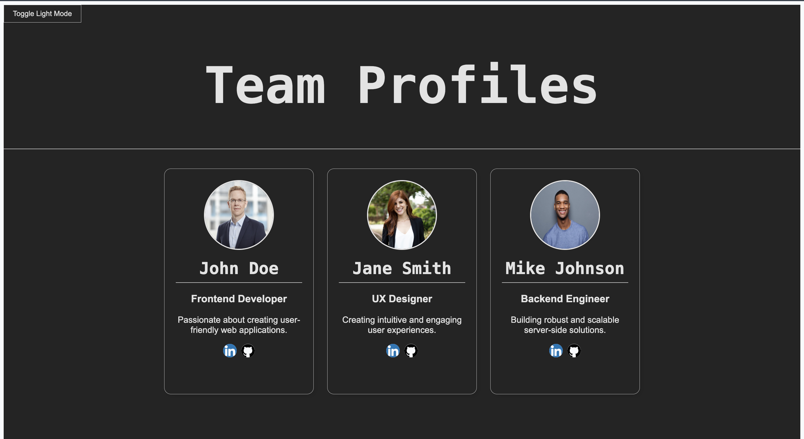

# 🧑‍💻 Profile Card Showcase

A simple and responsive React app that displays team member profiles in styled cards with light/dark mode and animated transitions.

## ✨ Features

- Responsive layout for mobile, tablet, and desktop
- Light/Dark mode toggle 🌗
- Hover effects on profile images
- Social media icons (LinkedIn & GitHub)
- Smooth card fade-in animations with staggered delays
- Clean, modular code structure

## 🚀 Live Demo

Check it out here: [https://teamprofiles.netlify.app/]

## 🛠️ Tech Stack

- React
- Vite
- CSS (custom)
- Netlify (for deployment)

## 🧠 Learning Goals

This project helped me practice:

- CSS responsiveness and animation
- Theme toggling using React hooks
- Component props and styling logic
- GitHub/Netlify integration

## 📸 Preview

